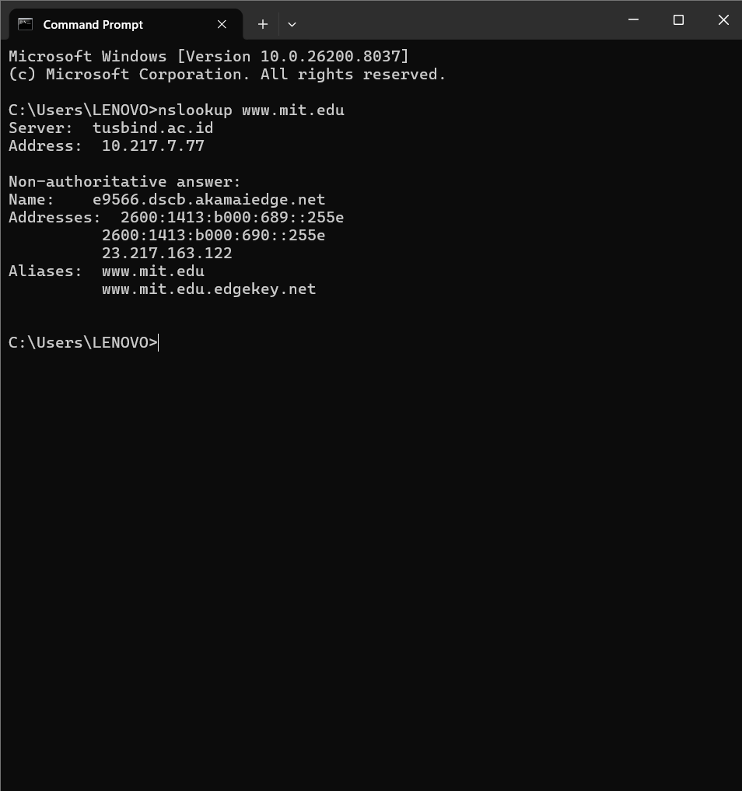
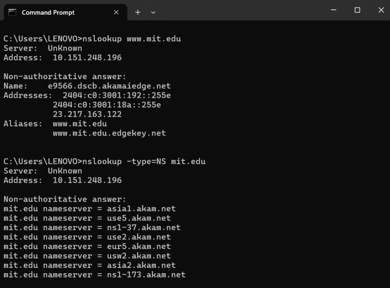
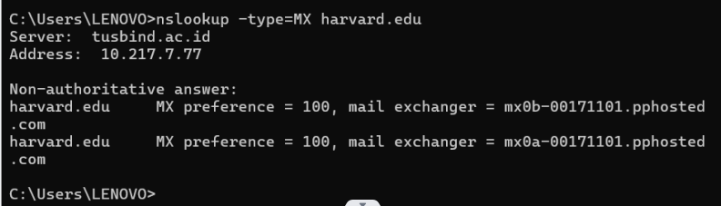
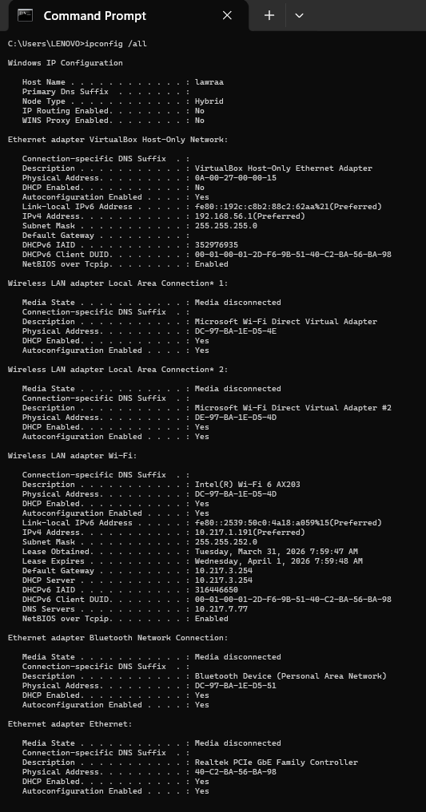
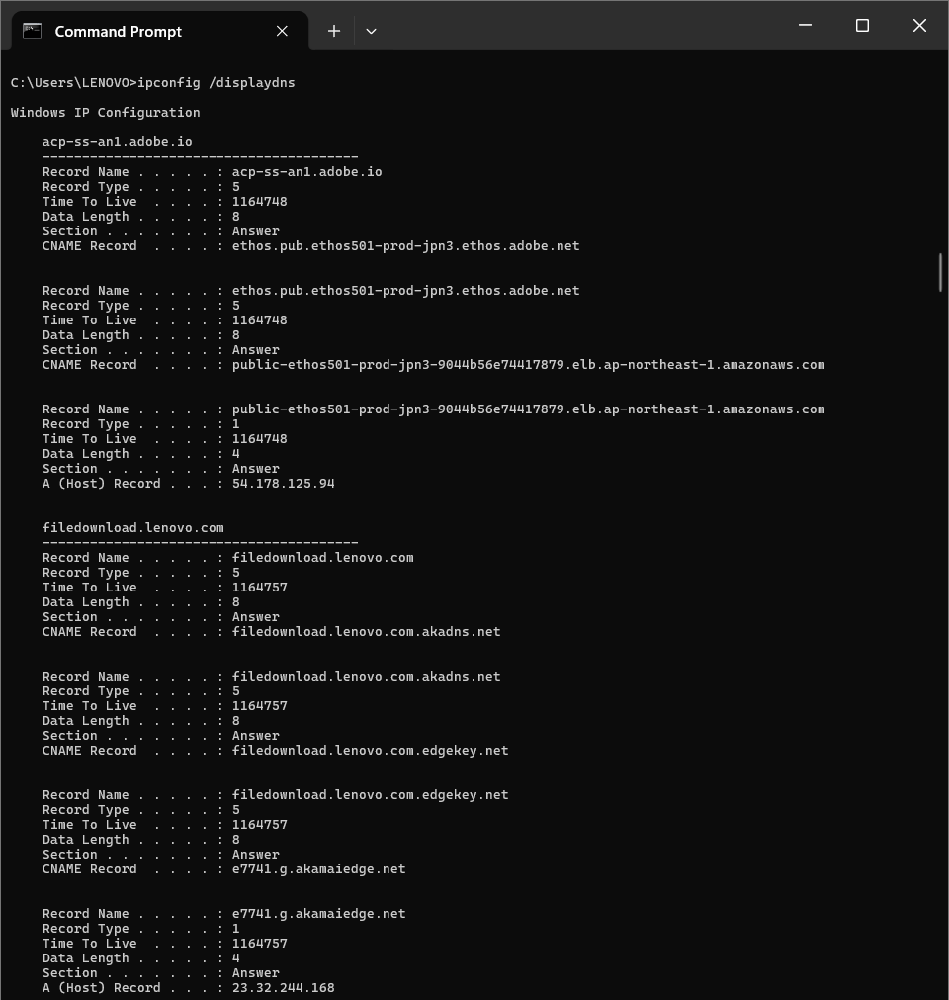
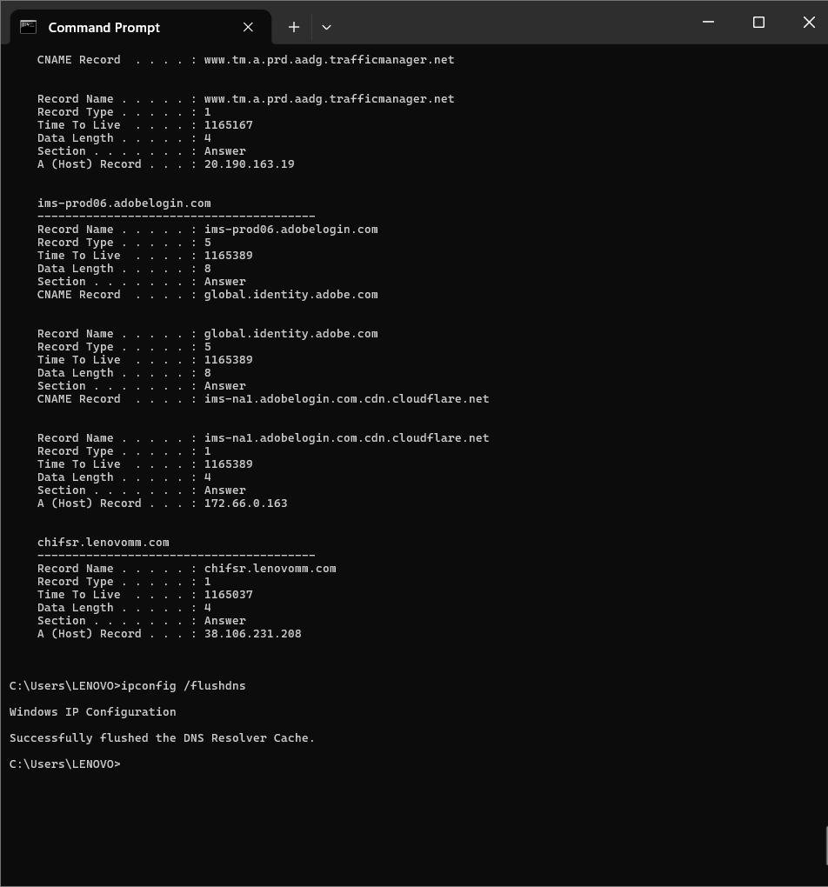
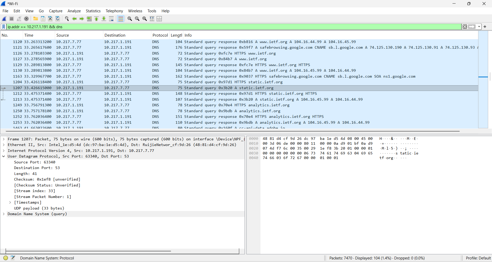

# Laporan Praktikum Jaringan Komputer - Modul 4
**Domain Name System (DNS)**

## Identitas Praktikan
| Item | Keterangan |
| :--- | :--- |
| Nama | Laura Chyndearni Saragih |
| NIM | 103072400049 |
| Kelas | IF-04-01 |

## 4.1 Tujuan Praktikum
1. Memahami cara kerja DNS dan hierarki resolusi nama domain  
2. Menggunakan nslookup untuk query berbagai jenis record DNS (A, NS, MX)  
3. Menganalisis paket DNS menggunakan Wireshark  
4. Memahami konsep DNS cache dan TTL  

## 4.2 Praktikum: Query DNS dengan nslookup

### 4.2.1 Query A Record (Basic Lookup)
**Perintah:**
```cmd
nslookup www.mit.edu
```

**Hasil:**


```text
Server:  tusbind.ac.id
Address:  10.217.7.77

Non-authoritative answer:
Name:    e9566.dscb.akamaiedge.net
Addresses:  2600:1413:b000:689::255e
            2600:1413:b000:690::255e
            23.217.163.122
Aliases:  www.mit.edu
          www.mit.edu.edgekey.net
```

**Analisis:**
- DNS server yang digunakan adalah `tusbind.ac.id` (10.217.7.77).
- Jawaban bersifat *non-authoritative* karena berasal dari cache resolver lokal.
- Terjadi **CNAME chaining**: `www.mit.edu` → `www.mit.edu.edgekey.net` → `e9566.dscb.akamaiedge.net`, menunjukkan penggunaan CDN Akamai.
- Domain mendukung **dual-stack**: IPv4 (`23.217.163.122`) dan IPv6.

---

### 4.2.2 Query NS Record (Name Server)
**Perintah:**
```cmd
nslookup -type=NS mit.edu
```

**Hasil:**


```text
Server:  UnKnown
Address:  10.151.248.196

Non-authoritative answer:
mit.edu   nameserver = asia1.akam.net
mit.edu   nameserver = use5.akam.net
mit.edu   nameserver = ns1-37.akam.net
mit.edu   nameserver = use2.akam.net
mit.edu   nameserver = eur5.akam.net
mit.edu   nameserver = usw2.akam.net
mit.edu   nameserver = asia2.akam.net
mit.edu   nameserver = ns1-173.akam.net
```

**Analisis:**
- DNS server yang digunakan menampilkan "UnKnown" dengan IP `10.151.248.196`.
- Terdapat **8 nameserver** yang semuanya menggunakan infrastruktur Akamai (`.akam.net`).
- Nameserver tersebar secara global: **Asia** (`asia1`, `asia2`), **US** (`use2`, `use5`, `usw2`), **Europe** (`eur5`) → mendukung redundansi dan ketersediaan tinggi.

---

### 4.2.3 Query MX Record (Mail Server)
**Perintah:**
```cmd
nslookup -type=MX harvard.edu
```

**Hasil:**


```text
Server:  tusbind.ac.id
Address:  10.217.7.77

Non-authoritative answer:
harvard.edu   MX preference = 100, mail exchanger = mx0b-00171101.pphosted.com
harvard.edu   MX preference = 100, mail exchanger = mx0a-00171101.pphosted.com
```

**Analisis:**
- Domain `harvard.edu` menggunakan layanan pihak ketiga (`pphosted.com` / Proofpoint) untuk keamanan email.
- Kedua mail server memiliki nilai **preference = 100** yang sama, sehingga digunakan untuk **load balancing** (distribusi trafik email merata).

---

## 4.3 Manajemen DNS Cache (Windows)

### 4.3.1 Hasil `ipconfig /all`
**Hasil:**


```text
Host Name  . . . . . . . . : lawraa
Wireless LAN adapter Wi-Fi:
   Description  . . . . . : Intel(R) Wi-Fi 6 AX203
   Physical Address . . . : DC-97-8A-1E-D5-4D
   IPv4 Address . . . . . : 10.217.1.191
   Subnet Mask  . . . . . : 255.255.252.0
   Default Gateway  . . . : 10.217.3.254
   DNS Servers  . . . . . : 10.217.7.77
```

**Analisis:**
- IP lokal: `10.217.1.191` dengan subnet `/22` (jaringan kampus).
- DNS server: `10.217.7.77` → konsisten dengan hasil `nslookup` (`tusbind.ac.id`).
- Adapter Wi-Fi 6 (AX203) mendukung standar 802.11ax untuk koneksi lebih cepat.

---

### 4.3.2 Hasil `ipconfig /displaydns`
**Hasil:**


```text
Contoh Adobe:
Record Name  . . . . : acp-ss-an1.adobe.io
Record Type  . . . . : 5 (CNAME)
Time To Live . . . . : 1164748
A (Host) Record  . . : 54.178.125.94

Contoh Lenovo:
Record Name  . . . . : filedownload.lenovo.com
Record Type  . . . . : 5 (CNAME)
A (Host) Record  . . : 23.32.244.168
```

**Analisis:**
- Terjadi **CNAME chaining** pada kedua domain:
  - **Adobe**: Menggunakan infrastruktur AWS (`amazonaws.com`) di region Asia.
  - **Lenovo**: Menggunakan Akamai (`akamaiedge.net`) untuk distribusi file.
- **TTL tinggi** (>1.000.000 detik) menunjukkan record ini jarang berubah dan di-cache lama untuk efisiensi.

---

### 4.3.3 Hasil `ipconfig /flushdns`
**Perintah:**
```cmd
ipconfig /flushdns
```

**Hasil:**


```text
Windows IP Configuration
Successfully flushed the DNS Resolver Cache.
```

**Analisis:**
- Cache DNS lokal berhasil dihapus.
- Langkah ini penting sebelum capture Wireshark agar browser dipaksa melakukan query DNS baru ("fresh resolution") yang dapat diamati paket datanya.

---

## 4.4 Analisis Paket DNS dengan Wireshark

### 4.4.1 Capture DNS Traffic
**Filter Wireshark:**
```
ip.addr == 10.217.1.191 && dns
```

**Hasil Capture:**


```text
Frame 1207
Src IP: 10.217.1.191
Dst IP: 10.217.7.77
Protocol: UDP
Port: 63340 → 53
Query: static.ietf.org
Type: A (Host Address)
```

**Analisis:**
- DNS menggunakan protokol **UDP port 53** untuk query standar.
- Client `10.217.1.191` mengirim query ke DNS server lokal `10.217.7.77`.
- Browser juga melakukan query ke subdomain `static.ietf.org` untuk mengambil resource tambahan (CSS, JS, gambar).
- MAC Address sumber sesuai dengan data fisik adapter Wi-Fi pada `ipconfig /all`.

---

## 4.5 Ringkasan Hasil Praktikum
| Parameter | Nilai / Keterangan |
| :--- | :--- |
| Protokol DNS | UDP port 53 |
| DNS Server Kampus | `tusbind.ac.id` (10.217.7.77) |
| Query Type yang diuji | A, NS, MX |
| CNAME Chaining | Terdeteksi pada MIT (Akamai), Adobe (AWS), Lenovo (Akamai) |
| IP Client | 10.217.1.191 (DHCP, Wi-Fi 6) |
| Tools utama | `nslookup`, `ipconfig`, Wireshark |

---

## 4.6 Kesimpulan
1. **DNS Hierarchy**: `nslookup` membuktikan bahwa server DNS kampus (`10.217.7.77`) bertindak sebagai *recursive resolver* yang menerjemahkan nama domain menjadi IP untuk klien.
2. **CDN & Load Balancing**: Hasil query A Record dan MX Record menunjukkan bahwa institusi besar (MIT, Harvard) menggunakan pihak ketiga (Akamai, Proofpoint) untuk keamanan dan distribusi konten.
3. **DNS Cache**: Perintah `ipconfig /displaydns` menunjukkan bahwa sistem operasi menyimpan hasil resolusi untuk waktu yang lama (TTL tinggi), sementara `flushdns` diperlukan untuk mereset cache saat analisis paket.
4. **Analisis Paket**: Wireshark mengonfirmasi bahwa proses resolusi DNS mendahului koneksi aplikasi. Klien mengirim query UDP port 53 ke server DNS lokal sebelum melakukan koneksi TCP/HTTPS ke tujuan akhir.

---

## Daftar Pustaka
1. Modul Praktikum Jaringan Komputer, Universitas Telkom (2026).
2. Wireshark Documentation. https://www.wireshark.org/docs/
3. RFC 1034 & RFC 1035 - Domain Names - Concepts and Facilities.
4. Cloudflare. What is DNS? https://www.cloudflare.com/learning/dns/
```
