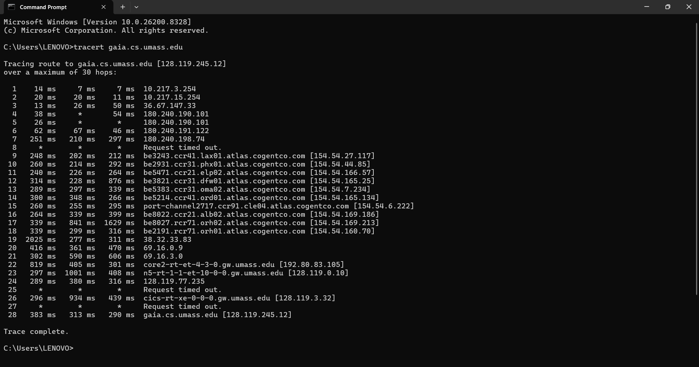
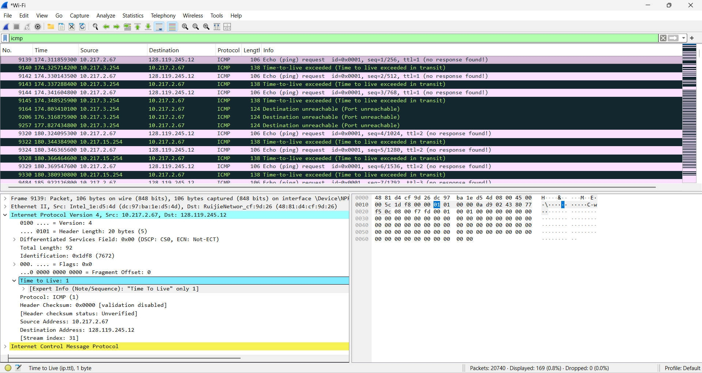
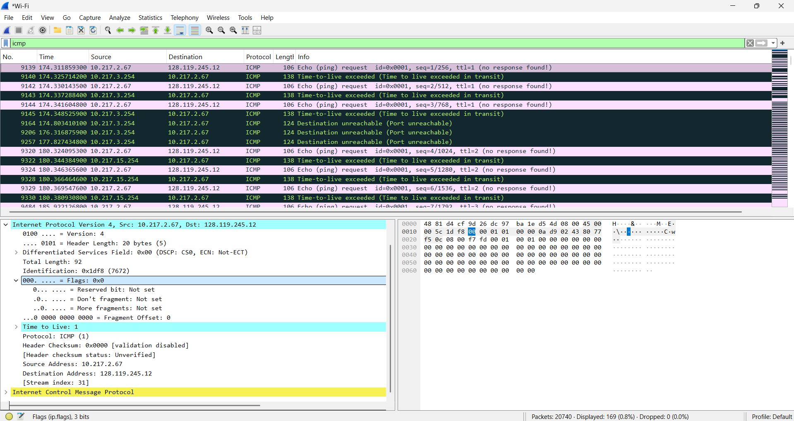

# Laporan Praktikum Jaringan Komputer – Modul 10  
## Internet Protocol (IP)

---

## Identitas Praktikan

| Item | Keterangan |
|------|-----------|
| Nama | Laura Chyndearni Saragih |
| NIM | 103072400049 |
| Kelas | IF-04-01 |

---

## 10.1 Tujuan Praktikum

1. Memahami cara kerja Internet Protocol (IP)
2. Mengamati proses pengiriman paket menggunakan traceroute
3. Menganalisis nilai Time To Live (TTL)
4. Mengamati Header Length dan Fragment Offset pada paket IPv4 menggunakan Wireshark

---

## 10.2 Menjalankan Traceroute

Pada praktikum ini dilakukan pengujian menggunakan perintah `tracert` untuk mengetahui jalur paket menuju server tujuan.

Perintah yang digunakan:

```bash
tracert gaia.cs.umass.edu
```

Berikut hasil traceroute (assets/tracert_result.png):



### Analisis

Hasil traceroute menunjukkan paket melewati beberapa router sebelum mencapai server tujuan. Setiap router akan mengurangi nilai TTL hingga paket mencapai host tujuan.

---

## 10.3 Analisis Time To Live (TTL)

Filter yang digunakan pada Wireshark:

```text
icmp
```

Kemudian dipilih paket ICMP untuk melihat informasi pada Internet Protocol Version 4.

Berikut hasil analisis TTL (assets/ip_ttl.png):



### Informasi hasil capture

```text
Protocol : ICMP
Time To Live : 1
```

### Analisis

TTL (Time To Live) digunakan untuk membatasi jumlah hop yang dapat dilalui paket.

Pada hasil capture terlihat nilai:

- TTL = 1

Ketika nilai TTL mencapai 0, router akan mengembalikan pesan:

```text
Time-to-live exceeded
```

---

## 10.4 Analisis Fragment Offset

Berikut hasil pengamatan Fragment Offset (assets/ip_fragment_offset.png):


### Informasi hasil capture

```text
Identification : 0x1df8
Flags          : 0x0
Fragment Offset: 0
```

### Analisis

Fragment Offset digunakan untuk menentukan posisi fragmen paket dalam proses fragmentasi.

Hasil pengamatan menunjukkan:

- Fragment Offset = 0
- Flags = 0

Artinya paket tidak mengalami fragmentasi.

---

## 10.5 Analisis Header Length

Berikut hasil pengamatan Header Length (assets/ip_header_length.png):



### Informasi hasil capture

```text
Version       : IPv4
Header Length : 20 bytes (5)
```

### Analisis

Header Length menunjukkan ukuran header pada paket IPv4.

Pada hasil pengamatan:

- Header Length = 20 byte

Nilai tersebut merupakan ukuran standar header IPv4 tanpa opsi tambahan.

---

## 10.6 Kesimpulan

Berdasarkan praktikum yang telah dilakukan dapat disimpulkan bahwa:

1. Internet Protocol digunakan untuk proses pengiriman paket antar host pada jaringan.
2. Traceroute dapat digunakan untuk mengetahui jalur pengiriman paket menuju tujuan.
3. TTL digunakan untuk membatasi jumlah hop paket.
4. Fragment Offset digunakan dalam proses fragmentasi paket.
5. Header Length menunjukkan ukuran header yang dimiliki paket IPv4.
