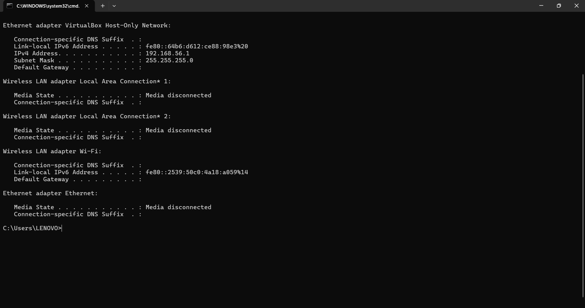
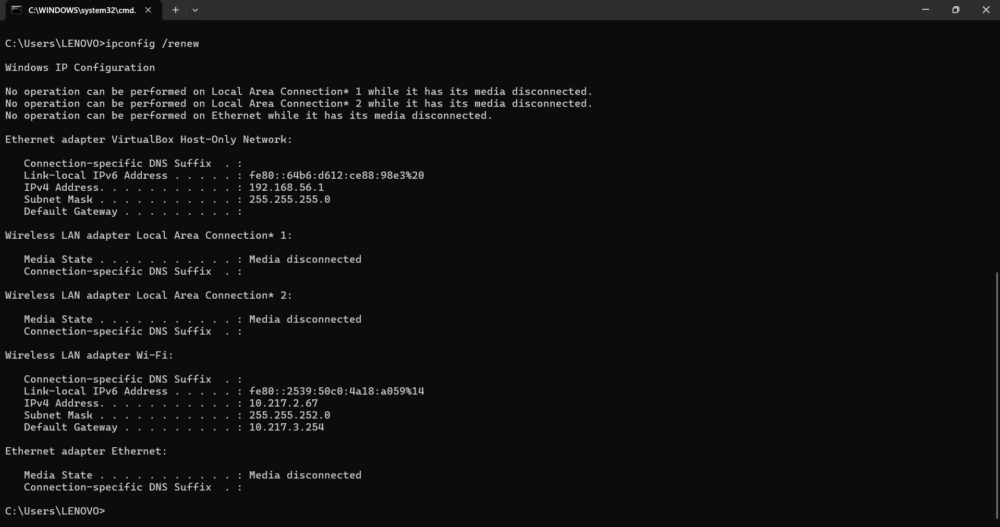
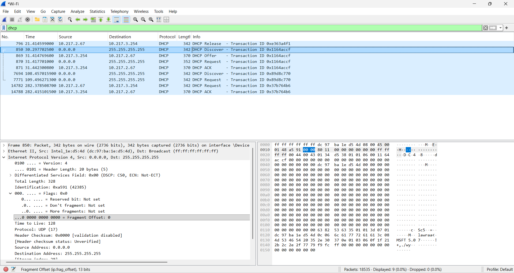
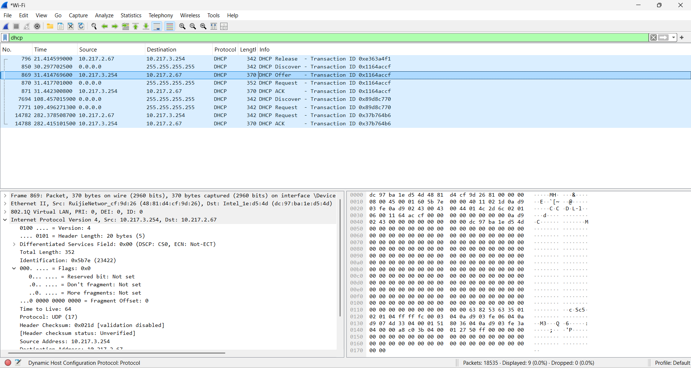
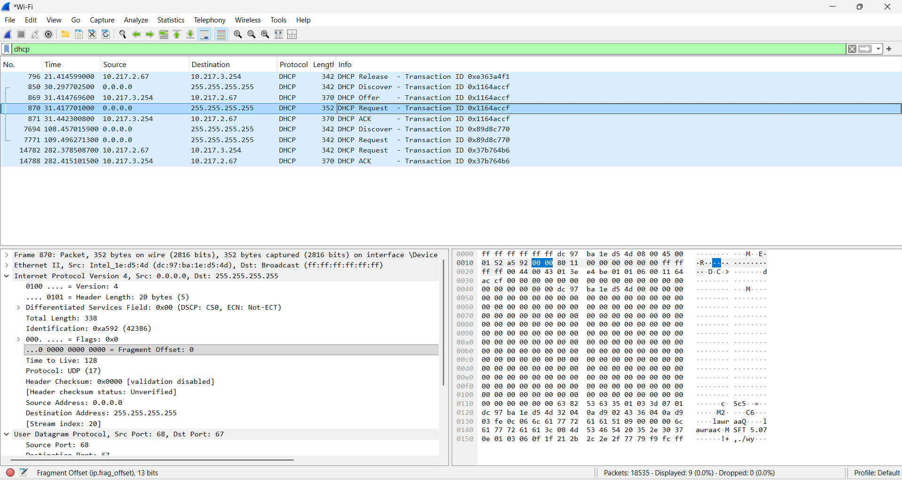
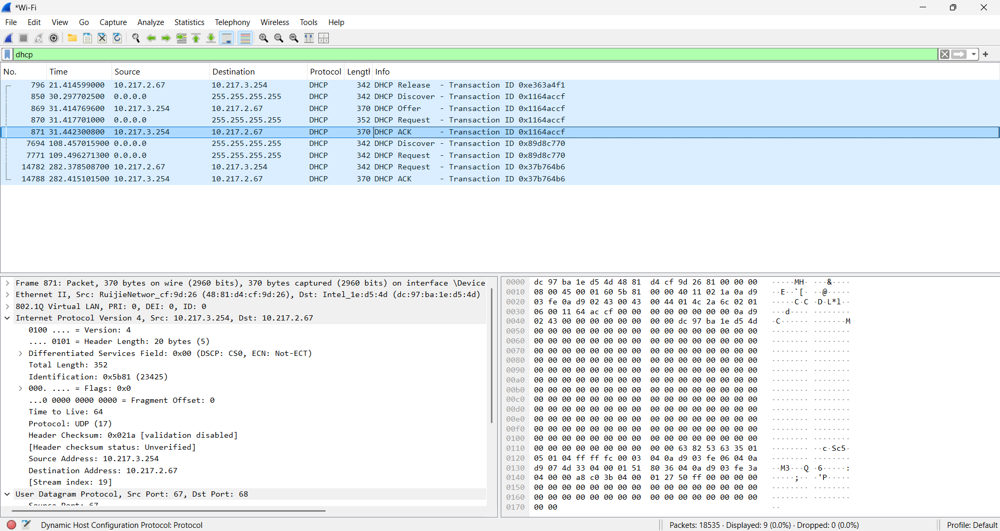

# Laporan Praktikum Jaringan Komputer – Modul 11  
## Dynamic Host Configuration Protocol (DHCP)

---

## Identitas Praktikan

| Item | Keterangan |
|------|-----------|
| Nama | Laura Chyndearni |
| NIM | 103072400049 |
| Kelas | IF-04-01 |

---

## 11.1 Tujuan Praktikum

1. Memahami mekanisme kerja Dynamic Host Configuration Protocol (DHCP)
2. Mengamati proses pemberian alamat IP secara otomatis
3. Menganalisis pertukaran paket DHCP menggunakan Wireshark
4. Mengidentifikasi tahapan komunikasi DHCP

---

## 11.2 Melepaskan Alamat IP (Release)

Pada tahap ini dilakukan pelepasan alamat IP menggunakan Command Prompt.

Perintah yang digunakan:

```bash
ipconfig /release
```

Berikut hasil pelepasan alamat IP (assets/dhcp_release.png):



### Analisis

Perintah `ipconfig /release` digunakan untuk melepaskan alamat IP yang sedang digunakan oleh perangkat.

Setelah proses release:
- Alamat IP dilepas sementara
- Default Gateway tidak aktif
- Client belum memiliki konfigurasi jaringan

---

## 11.3 Meminta Alamat IP Baru (Renew)

Setelah IP dilepas, dilakukan permintaan alamat IP baru.

Perintah yang digunakan:

```bash
ipconfig /renew
```

Berikut hasil pembaruan alamat IP (assets/dhcp_renew.png):



### Analisis

Perintah `ipconfig /renew` digunakan untuk meminta alamat IP baru dari DHCP Server sehingga perangkat dapat kembali terhubung ke jaringan.

---

## 11.4 DHCP Discover

Setelah proses renew dilakukan, paket DHCP diamati menggunakan filter:

```text
dhcp
```

Paket pertama yang diamati adalah DHCP Discover.

Berikut hasil capture DHCP Discover (assets/dhcp_discover.png):



### Informasi hasil capture

```text
Source Address      : 0.0.0.0
Destination Address : 255.255.255.255
Protocol            : DHCP
```

### Analisis

DHCP Discover merupakan paket broadcast yang dikirim oleh client untuk mencari DHCP Server yang tersedia pada jaringan.

---

## 11.5 DHCP Offer

Setelah menerima Discover, server memberikan penawaran alamat IP.

Berikut hasil capture DHCP Offer (assets/dhcp_offer.png):



### Informasi hasil capture

```text
Protocol : DHCP
Message  : DHCP Offer
```

### Analisis

DHCP Offer merupakan respon dari server yang menawarkan alamat IP beserta konfigurasi jaringan kepada client.

---

## 11.6 DHCP Request

Setelah mendapatkan penawaran, client mengirim permintaan penggunaan alamat IP.

Berikut hasil capture DHCP Request (assets/dhcp_request.png):



### Informasi hasil capture

```text
Protocol : DHCP
Message  : DHCP Request
```

### Analisis

DHCP Request menunjukkan client memilih alamat IP yang ditawarkan dan mengirim permintaan resmi kepada server.

---

## 11.7 DHCP ACK

Tahap terakhir adalah konfirmasi dari server.

Berikut hasil capture DHCP ACK (assets/dhcp_ack.png):



### Informasi hasil capture

```text
Protocol : DHCP
Message  : DHCP ACK
```

### Analisis

DHCP ACK merupakan konfirmasi bahwa server menyetujui pemberian alamat IP kepada client dan konfigurasi jaringan berhasil diterapkan.

---

## 11.8 Urutan Proses DHCP

Urutan komunikasi DHCP yang diamati:

```text
DHCP Discover
↓
DHCP Offer
↓
DHCP Request
↓
DHCP ACK
```

Tahapan tersebut dikenal sebagai proses **DORA (Discover, Offer, Request, Acknowledge)**.

---

## 11.9 Kesimpulan

Berdasarkan praktikum yang telah dilakukan dapat disimpulkan bahwa:

1. DHCP digunakan untuk memberikan alamat IP secara otomatis kepada client.
2. Proses pemberian IP mengikuti urutan DORA.
3. Client dapat melepaskan alamat IP menggunakan `ipconfig /release`.
4. Client dapat meminta alamat IP baru menggunakan `ipconfig /renew`.
5. Wireshark dapat digunakan untuk menganalisis paket DHCP secara detail.
