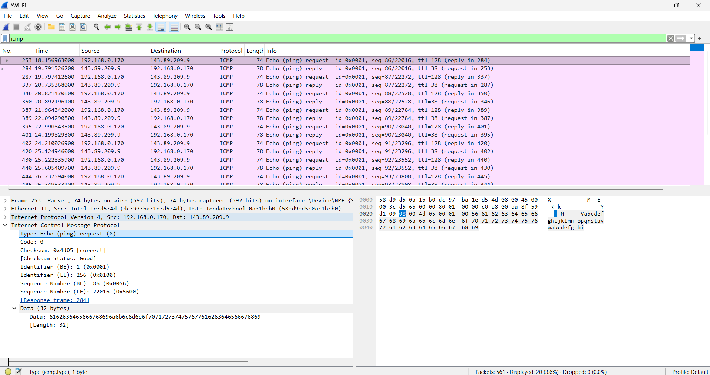
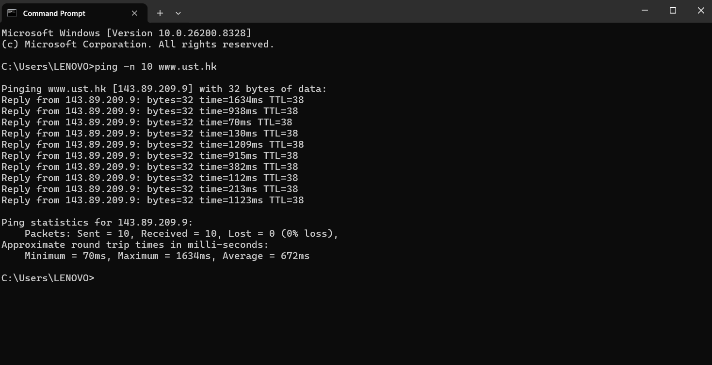
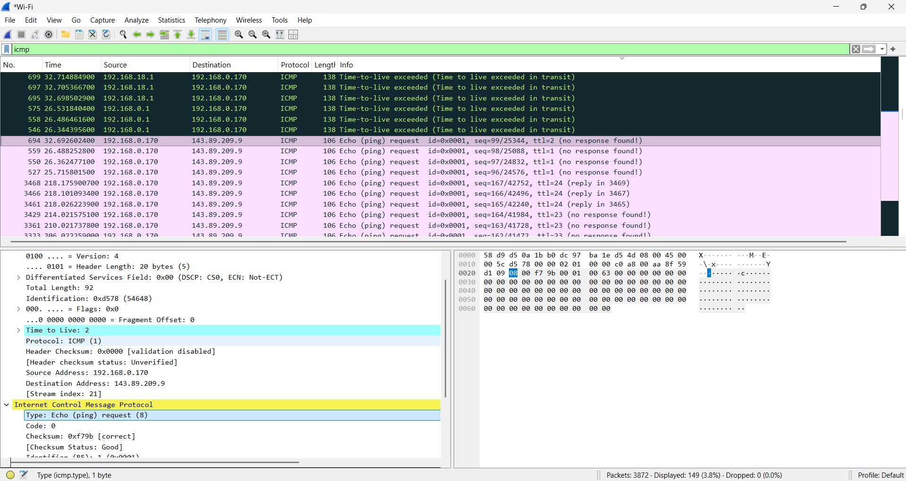
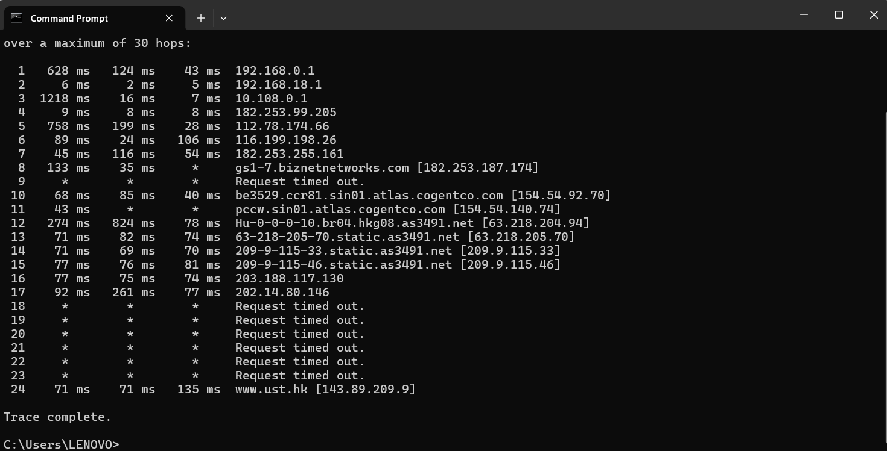
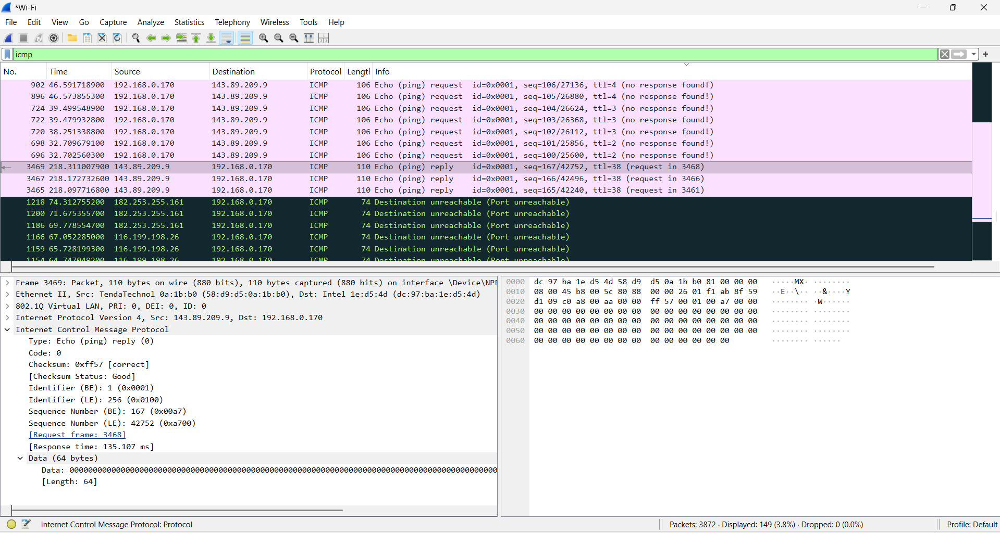
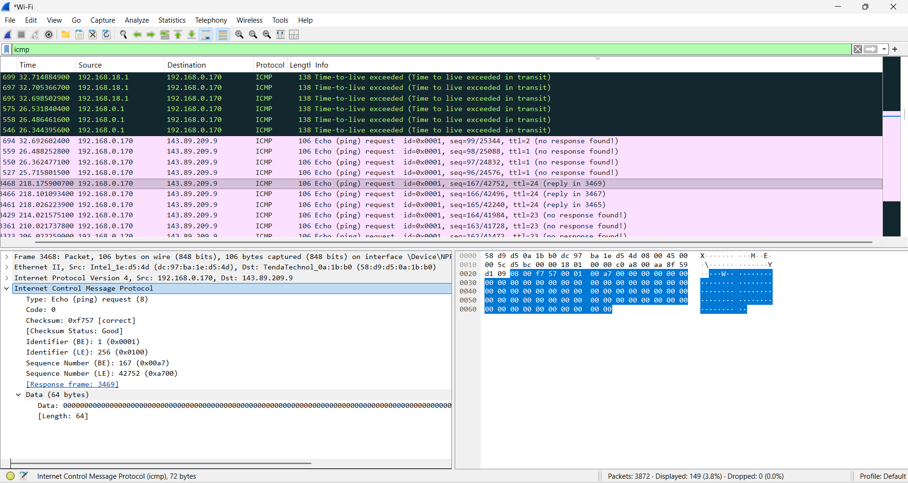

# Modul 12 – ICMP (Internet Control Message Protocol)

## Identitas Praktikan

| Item | Keterangan |
|------|-----------|
| Nama | Laura Chyndearni Saragih |
| NIM | 103072400049 |
| Kelas | IF-04-01 |

## Tujuan Praktikum
1. Memahami cara kerja protokol ICMP.
2. Mengamati proses pengiriman dan penerimaan paket ICMP menggunakan Wireshark.
3. Menganalisis proses ping dan traceroute.
4. Membandingkan paket Echo Request dan Echo Reply.

---

# Percobaan 1 – ICMP Ping

## Langkah Percobaan
1. Membuka Wireshark dan memulai proses capture pada interface Wi-Fi.
2. Membuka Command Prompt.
3. Menjalankan perintah:

```bash
ping -n 10 www.ust.hk
```

4. Menunggu proses ping selesai.
5. Menghentikan capture di Wireshark.
6. Memasukkan filter:

```text
icmp
```

7. Mengamati paket Echo Request dan Echo Reply.

---

## Hasil Ping

### Hasil Capture Wireshark


### Hasil Command Prompt


---

## Analisis
Pada percobaan ini dilakukan pengiriman 10 paket ICMP Echo Request menuju server `www.ust.hk`. Dari hasil yang diperoleh seluruh paket berhasil diterima kembali sehingga packet loss bernilai **0%**.

Wireshark menampilkan dua jenis paket:
- **Echo Request (Type 8)** → paket yang dikirim oleh client.
- **Echo Reply (Type 0)** → paket balasan dari server.

Setiap request yang berhasil dikirim akan menerima balasan dengan identifier dan sequence number yang sama.

---

# Percobaan 2 – ICMP Traceroute

## Langkah Percobaan
1. Menghapus filter pada Wireshark.
2. Memulai capture kembali.
3. Membuka Command Prompt.
4. Menjalankan perintah:

```bash
tracert www.ust.hk
```

5. Menunggu hingga proses selesai.
6. Menghentikan capture.
7. Memasukkan filter:

```text
icmp
```

8. Mengamati paket ICMP.

---

## Hasil Traceroute

### Capture Wireshark


### Hasil Command Prompt


---

## Analisis
Traceroute bekerja dengan mengirim paket ICMP menggunakan nilai TTL (Time To Live) yang meningkat secara bertahap.

Ketika nilai TTL habis sebelum mencapai tujuan, router akan mengirim pesan:

```text
Time-to-live exceeded
```

Beberapa hop menghasilkan:

```text
Request timed out
```

Hal tersebut normal karena tidak semua router mengirim balasan ICMP.

Pada percobaan ini traceroute tetap berhasil mencapai tujuan akhir yaitu:

```text
www.ust.hk [143.89.209.9]
```

---

# Percobaan 3 – Perbandingan Echo Request dan Echo Reply

## Langkah Percobaan
1. Memilih paket **Echo Request** yang memiliki pasangan reply.
2. Membuka bagian:

```text
Internet Control Message Protocol
```

3. Mencatat informasi:
   - Type
   - Code
   - Identifier
   - Sequence Number

4. Membuka paket reply yang sesuai.
5. Membandingkan hasilnya.

---

## Dokumentasi

### Echo Request dan Echo Reply


### Detail Echo Request


---

## Hasil Perbandingan

| Parameter | Echo Request | Echo Reply |
|---|---:|---:|
| Type | 8 | 0 |
| Code | 0 | 0 |
| Identifier | 0x0001 | 0x0001 |
| Sequence Number | 167 | 167 |

---

## Analisis
Dari hasil pengamatan diperoleh bahwa:

- **Type berubah** dari Request (8) menjadi Reply (0).
- **Identifier tetap sama** karena digunakan untuk mencocokkan pasangan paket.
- **Sequence Number tetap sama** sebagai penanda paket balasan dari request yang sama.

Perbedaan tersebut menunjukkan bahwa ICMP menggunakan identifier dan sequence number untuk melakukan pelacakan komunikasi antara pengirim dan penerima.

---

# Kesimpulan

Berdasarkan praktikum yang telah dilakukan dapat disimpulkan bahwa:

1. ICMP digunakan untuk pengujian konektivitas dan pelaporan kondisi jaringan.
2. Ping menggunakan mekanisme Echo Request dan Echo Reply.
3. Traceroute memanfaatkan perubahan nilai TTL untuk mengetahui jalur jaringan.
4. Identifier dan Sequence Number digunakan untuk mencocokkan paket request dan reply.

