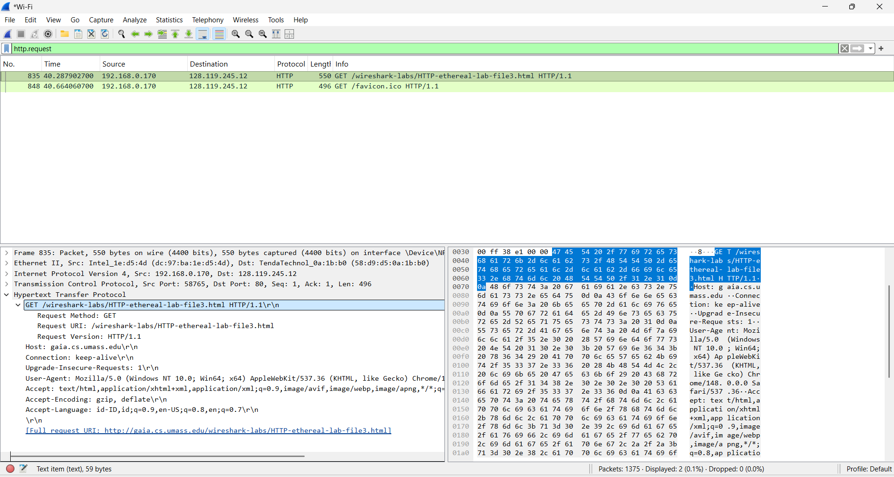
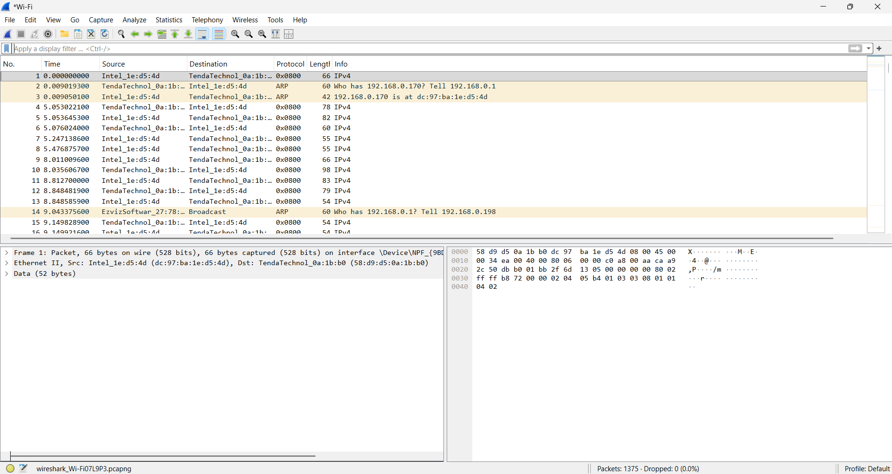
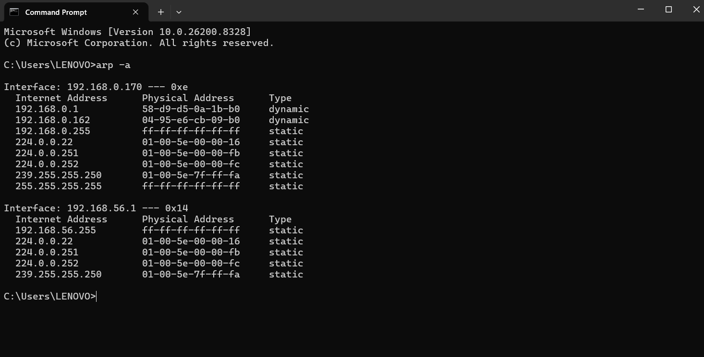

# Laporan Praktikum Jaringan Komputer – Ethernet dan ARP

| Item | Keterangan |
|------|-----------|
| Nama | Laura Chyndearni Saragih |
| NIM | 103072400049 |
| Kelas | IF-04-01 |

---

## Tujuan Praktikum

1. Mengamati paket HTTP Request menggunakan Wireshark.
2. Menganalisis struktur Ethernet Frame.
3. Mengamati isi ARP Cache pada perangkat.

---

## Langkah Praktikum

1. Menjalankan Wireshark dan memulai proses capture paket.
2. Membuka halaman praktikum HTTP.
3. Menggunakan filter:
   ```
   http.request
   ```
4. Mengamati paket HTTP GET.
5. Menonaktifkan IPv4 melalui:
   ```
   Analyze → Enabled Protocols → hilangkan centang IPv4
   ```
6. Mengamati struktur Ethernet Frame.
7. Menjalankan Command Prompt lalu menjalankan:
   ```
   arp -a
   ```
8. Mengamati hasil ARP Cache.

---

## 1. HTTP GET Request

Filter yang digunakan:

```text
http.request
```

Hasil menunjukkan browser mengirim **HTTP GET Request** ke server untuk meminta halaman web.

Berikut tampilan HTTP GET:

(assets/ethernet_http_get.png)



### Analisis

- Browser menggunakan metode **GET**.
- Request dikirim menggunakan **HTTP/1.1**.
- Tujuan request adalah server **gaia.cs.umass.edu**.
- HTTP digunakan untuk mengambil halaman dari server.

---

## 2. Analisis Ethernet Frame

Selanjutnya dilakukan analisis struktur Ethernet dengan menonaktifkan protokol IPv4.

Langkah:

```text
Analyze → Enabled Protocols → uncheck IPv4
```

Setelah IPv4 dinonaktifkan, Wireshark hanya menampilkan informasi layer Ethernet.

Berikut tampilan Ethernet Frame:

(assets/ethernet_frame.png)



### Analisis

- Struktur yang terlihat terdiri dari:
  - Frame
  - Ethernet II
  - Data
- Ethernet bekerja pada layer Data Link.
- Ethernet menggunakan alamat MAC untuk komunikasi antar perangkat.

---

## 3. Analisis ARP Cache

ARP Cache diamati menggunakan perintah:

```text
arp -a
```

Perintah tersebut menampilkan hubungan antara alamat IP dan alamat fisik (MAC Address).

Berikut hasil ARP Cache:

(assets/arp_cache.png)



### Analisis

Contoh hasil:

```text
IP Address      : 192.168.0.1
MAC Address     : 58-d9-d5-0a-1b-b0
Type            : dynamic
```

Interpretasi:

- ARP digunakan untuk menerjemahkan alamat IP menjadi MAC Address.
- Sistem menyimpan hasil translasi pada ARP Cache.
- Terdapat entri dynamic dan static.

---

## Kesimpulan

Pada praktikum ini dilakukan analisis terhadap HTTP Request, Ethernet Frame, dan ARP Cache menggunakan Wireshark dan Command Prompt.

Hasil menunjukkan bahwa:

- HTTP menggunakan metode GET untuk meminta halaman dari server.
- Ethernet bertugas mengatur komunikasi pada layer Data Link menggunakan MAC Address.
- ARP berfungsi menerjemahkan alamat IP menjadi alamat fisik agar perangkat dapat saling berkomunikasi dalam jaringan lokal.

Praktikum berhasil dijalankan dan seluruh proses dapat diamati menggunakan Wireshark.
