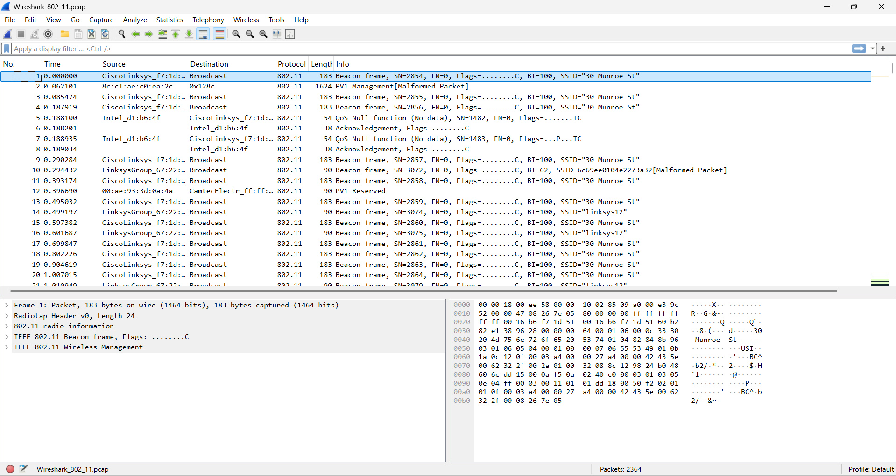
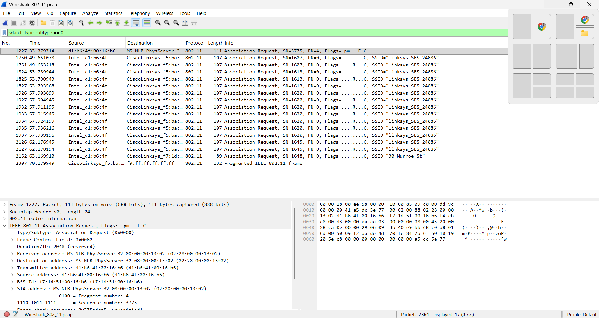
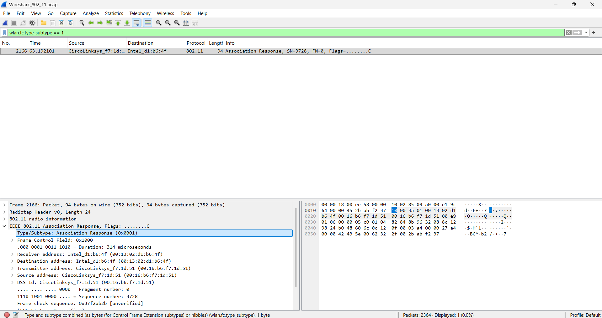
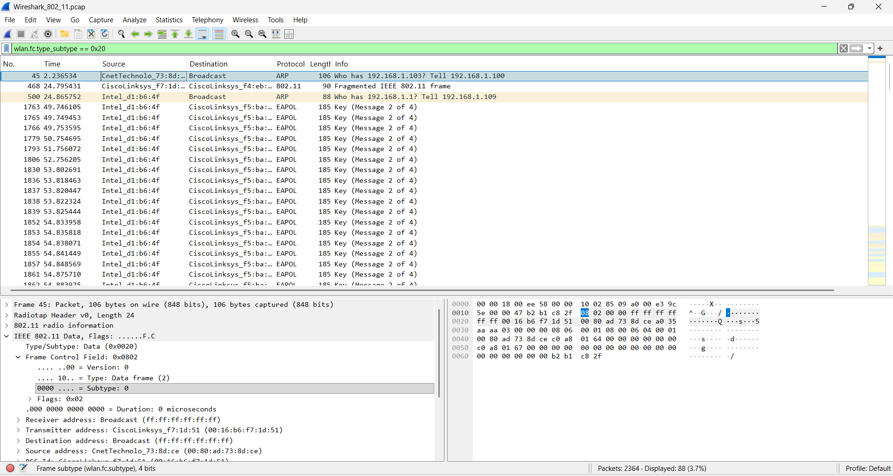

# Modul 14 – IEEE 802.11 (WiFi)

## Nama Praktikum
Analisis Frame IEEE 802.11 Menggunakan Wireshark

## Tujuan
1. Mengidentifikasi jenis-jenis frame pada protokol IEEE 802.11.
2. Menganalisis Beacon Frame pada jaringan WiFi.
3. Mengamati proses Association Request dan Association Response.
4. Mengidentifikasi Data Frame pada jaringan IEEE 802.11.
5. Memahami proses komunikasi antara Station (STA) dan Access Point (AP).

---

## Langkah Praktikum

### 1. Membuka File Capture IEEE 802.11

File capture `Wireshark_802_11.pcap` dibuka menggunakan Wireshark. Capture tersebut berisi lalu lintas komunikasi jaringan nirkabel IEEE 802.11 yang digunakan untuk proses analisis.

---

### 2. Analisis Beacon Frame

Filter yang digunakan:

```text
wlan.fc.type_subtype == 0x08
```

Beacon Frame digunakan oleh Access Point untuk mengumumkan keberadaan jaringan WiFi kepada perangkat di sekitarnya. Frame ini berisi informasi penting seperti SSID, channel, capability information, dan parameter jaringan lainnya.

Screenshot:



Hasil pengamatan menunjukkan bahwa Access Point secara periodik mengirimkan Beacon Frame dengan informasi identitas jaringan yang dapat dideteksi oleh perangkat klien.

---

### 3. Analisis Association Request

Filter yang digunakan:

```text
wlan.fc.type_subtype == 0
```

Association Request dikirimkan oleh Station (STA) kepada Access Point untuk meminta izin bergabung ke jaringan WiFi setelah proses scanning dan autentikasi selesai dilakukan.

Screenshot:



Pada hasil capture terlihat frame bertipe Association Request yang dikirim oleh perangkat klien menuju Access Point. Frame ini berisi informasi kemampuan perangkat dan SSID yang ingin diakses.

---

### 4. Analisis Association Response

Filter yang digunakan:

```text
wlan.fc.type_subtype == 1
```

Association Response merupakan balasan dari Access Point terhadap Association Request yang dikirim oleh klien. Frame ini menentukan apakah permintaan asosiasi diterima atau ditolak.

Screenshot:



Hasil pengamatan menunjukkan Access Point mengirimkan Association Response kepada perangkat klien sebagai konfirmasi bahwa proses asosiasi berhasil dilakukan.

---

### 5. Analisis Data Frame

Filter yang digunakan:

```text
wlan.fc.type_subtype == 0x20
```

Data Frame digunakan untuk membawa payload data antara perangkat klien dan Access Point. Jenis frame ini merupakan frame yang paling sering muncul selama komunikasi normal berlangsung.

Screenshot:



Pada hasil capture terlihat frame bertipe Data Frame dengan nilai:

```text
Type = Data frame (2)
Subtype = Data (0)
```

Hal ini menunjukkan bahwa frame tersebut digunakan untuk mengirimkan data aktual pada jaringan WiFi.

---

## Analisis

Berdasarkan hasil pengamatan, komunikasi pada jaringan IEEE 802.11 terdiri dari beberapa jenis frame yang memiliki fungsi berbeda.

Beacon Frame digunakan Access Point untuk mengumumkan keberadaan jaringan. Setelah perangkat menemukan jaringan yang diinginkan, perangkat akan mengirimkan Association Request untuk meminta bergabung ke jaringan tersebut. Access Point kemudian memberikan Association Response sebagai konfirmasi keberhasilan proses asosiasi.

Setelah proses asosiasi berhasil, komunikasi data dilakukan menggunakan Data Frame. Frame inilah yang membawa informasi aktual yang dipertukarkan antara klien dan Access Point selama koneksi berlangsung.

Dengan menggunakan Wireshark, struktur dan fungsi masing-masing frame IEEE 802.11 dapat diamati secara langsung sehingga memudahkan pemahaman mengenai mekanisme kerja jaringan nirkabel.

---

## Kesimpulan

1. IEEE 802.11 menggunakan berbagai jenis frame untuk mengatur komunikasi jaringan nirkabel.
2. Beacon Frame digunakan untuk mengumumkan informasi jaringan WiFi kepada perangkat di sekitarnya.
3. Association Request dikirim oleh klien untuk meminta bergabung ke jaringan.
4. Association Response digunakan Access Point untuk mengonfirmasi proses asosiasi.
5. Data Frame digunakan untuk membawa payload data selama komunikasi berlangsung.
6. Wireshark dapat digunakan untuk mengidentifikasi dan menganalisis setiap jenis frame IEEE 802.11 secara detail.

---
