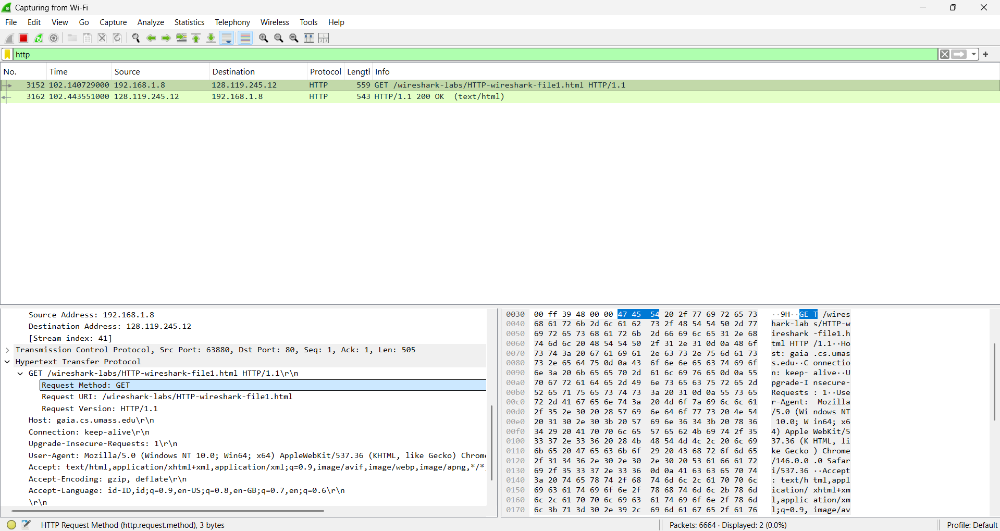
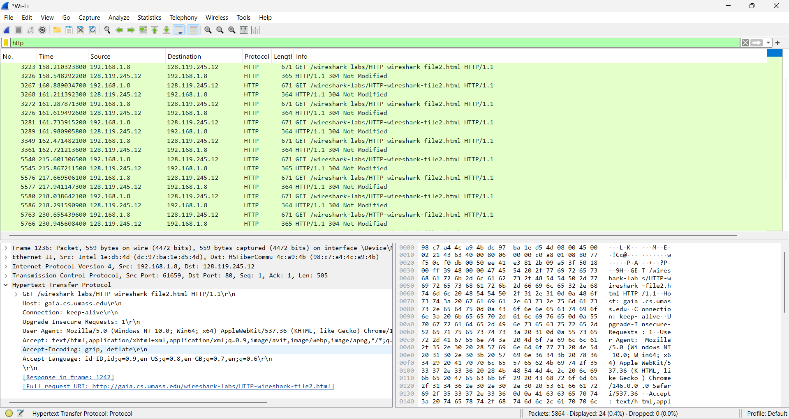
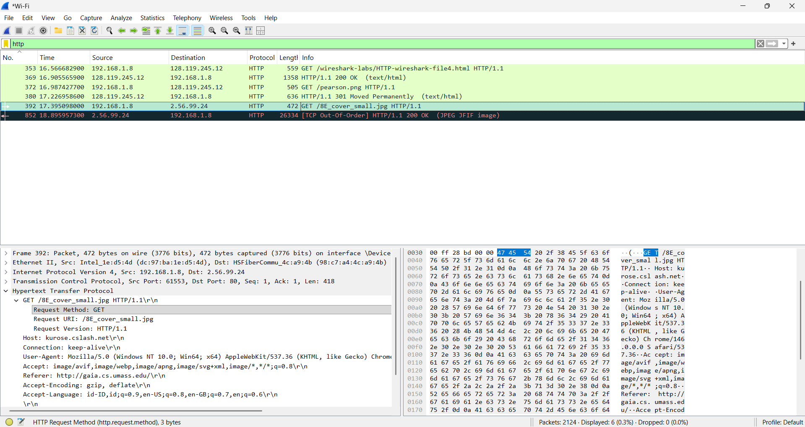
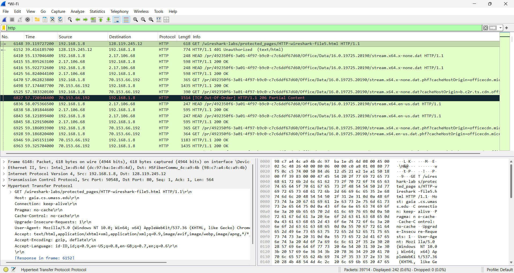
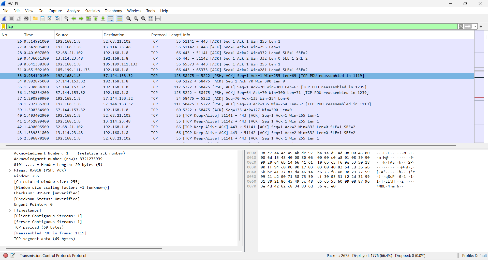

# Laporan Praktikum Jaringan Komputer - Modul 3
## Analisis Protokol HTTP Menggunakan Wireshark

---

## Identitas Praktikan

| Item | Keterangan |
|------|------------|
| Nama | Laura Chyndearni Saragih |
| NIM | 103072400049 |
| Kelas | IF-04-01 |

---

## 1. Tujuan Praktikum

Adapun tujuan dari praktikum ini adalah:
1. Memahami cara kerja protokol HTTP menggunakan Wireshark.
2. Mengamati proses komunikasi antara client dan server.
3. Mengetahui mekanisme caching, embedded object, TCP, dan autentikasi.

---

## 2. Dasar Teori

HTTP (Hypertext Transfer Protocol) adalah protokol pada layer aplikasi yang digunakan untuk komunikasi antara client (browser) dan server.

Konsep penting:
- HTTP GET → meminta data
- Response → balasan server
- Cache → menghindari download ulang
- TCP → membagi data besar
- Authentication → login

---

## 3. Langkah Kerja

### 3.1 Basic HTTP GET
Mengakses file1.html dan melihat request GET serta response.

### 3.2 Conditional GET
Mengakses file2.html lalu refresh halaman.

### 3.3 Embedded Object
Mengakses file4.html yang berisi gambar.

### 3.4 HTTP Authentication
Mengakses file5.html dan login.

### 3.5 TCP
Menggunakan filter tcp untuk melihat segment.

---

## 4. Hasil dan Pembahasan

### 4.1 Basic HTTP GET

Analisis:
Terlihat request GET dari client dan response **200 OK** dari server yang menunjukkan file berhasil diambil.

---

### 4.2 Conditional GET

Analisis:
Server memberikan response **304 Not Modified** karena file tidak berubah dan browser menggunakan cache.

---

### 4.3 Embedded Object

Analisis:
Terdapat beberapa request HTTP karena halaman HTML memuat objek tambahan seperti gambar.

---

### 4.4 HTTP Authentication

Analisis:
Awalnya server memberikan response **401 Unauthorized**, kemudian setelah login berhasil muncul **200 OK**.

---

### 4.5 TCP (Long Document)

Analisis:
Data dikirim dalam beberapa segmen TCP, terlihat dari adanya "TCP segment of a reassembled PDU".

---

## 5. Kesimpulan

Dari praktikum ini dapat disimpulkan bahwa:

1. HTTP bekerja dengan sistem request dan response.
2. Status code menunjukkan hasil komunikasi (200, 304, 401).
3. Cache membantu efisiensi jaringan.
4. Data besar dikirim melalui beberapa segmen TCP.
5. Halaman web dapat memiliki banyak request.
6. Authentication digunakan untuk proteksi halaman.

---

## 6. Daftar Pustaka

- Kurose, J.F., & Ross, K.W. (2021). Computer Networking: A Top-Down Approach, 8th Edition. Pearson.
- Universitas Telkom. (2026). Modul Praktikum Jaringan Komputer Semester Genap 2025/2026. Fakultas Informatika.
- Wireshark Foundation. (2024). Wireshark User's Guide. Retrieved from https://www.wireshark.org/docs/
