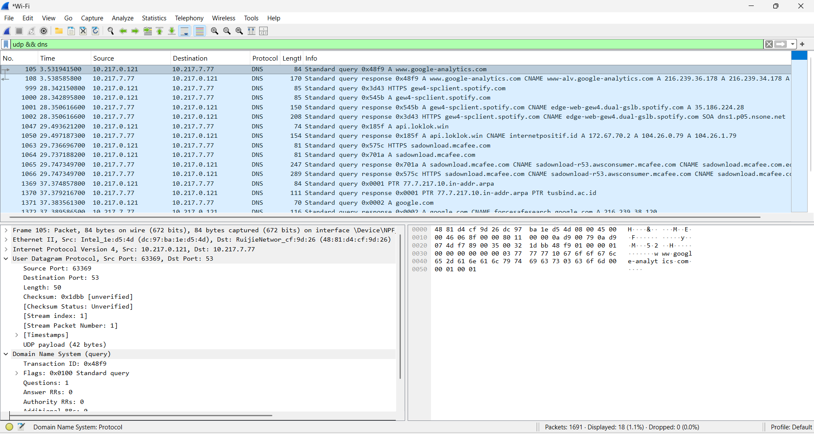
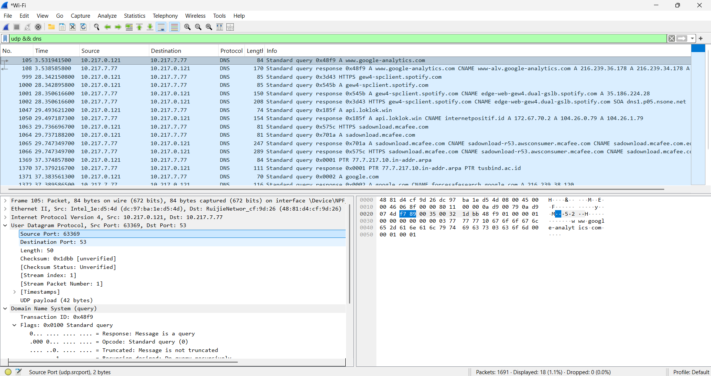
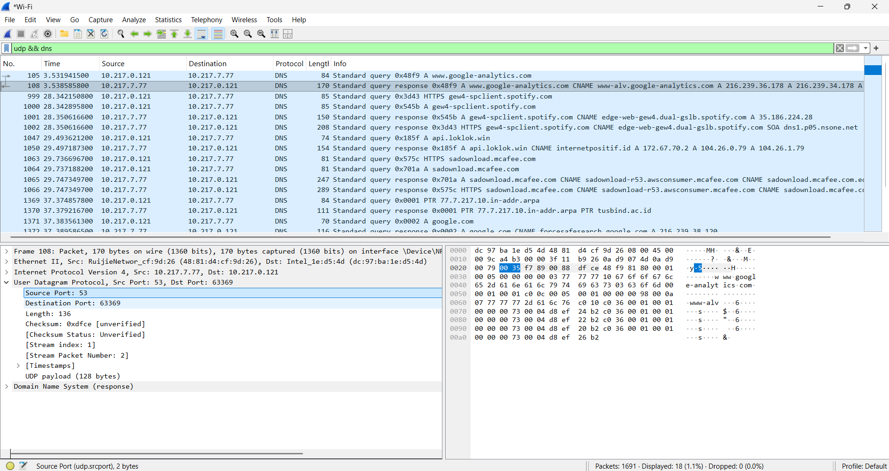
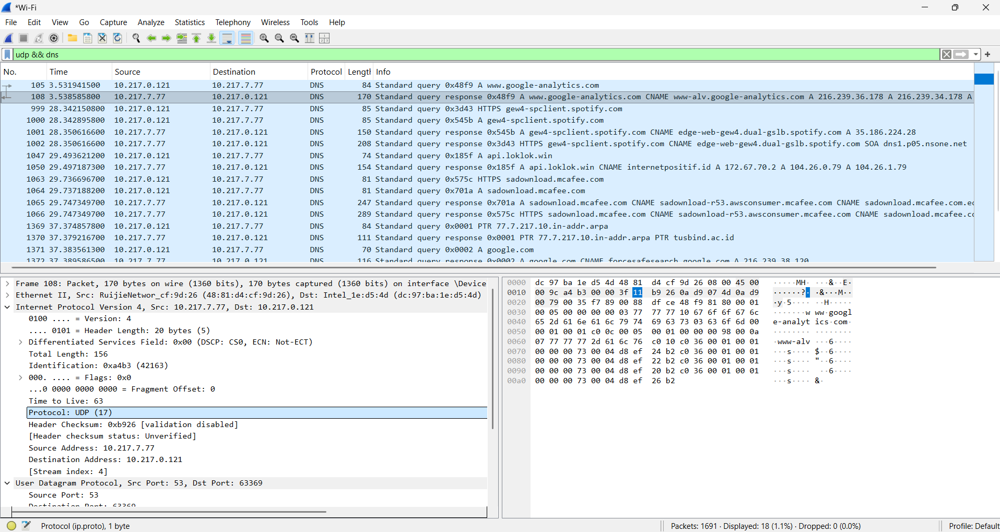

# Laporan Praktikum Jaringan Komputer - Modul 5

**User Datagram Protocol (UDP)**

## Identitas Praktikan

| Item  | Keterangan       |
| :---- | :--------------- |
| Nama  | Laura Chyndearni |
| NIM   | 103072400049     |
| Kelas | IF-04-01         |

---

## 5.1 Tujuan Praktikum

1. Menginvestigasi cara kerja protokol UDP menggunakan Wireshark
2. Mengidentifikasi struktur header UDP dan field-fieldnya
3. Menganalisis hubungan port source dan destination pada komunikasi UDP
4. Menghitung kapasitas maksimum payload UDP

---

## 5.2 Analisis Paket UDP Menggunakan Wireshark

### 5.2.1 Capture Paket UDP

**Langkah:**

Capture dilakukan menggunakan Wireshark dengan filter:

```
udp && dns
```

Traffic UDP dihasilkan melalui perintah:

```
ipconfig /flushdns
nslookup google.com
```

**Hasil Capture:**



```text
Frame 105
Protocol: DNS (UDP)
Source Port: 63369
Destination Port: 53
Query: www.google-analytics.com
```

**Analisis:**

* Paket menunjukkan proses **DNS Query** dari client menuju DNS server.
* Protokol DNS berjalan di atas **UDP port 53**.
* Client menggunakan **ephemeral port (63369)**.
* Server menggunakan **well-known port (53)**.

---

### 5.2.2 Analisis DNS Request

**Hasil Capture:**



```text
Frame: 105
Source Port: 63369
Destination Port: 53
Length: 50 byte
Checksum: 0x1dbb
```

**Analisis:**

* Paket merupakan DNS Request dari client ke DNS server.
* Field Length menunjukkan ukuran total segmen UDP (header + payload).
* Payload dihitung:

```
50 − 8 = 42 byte
```

---

### 5.2.3 Analisis DNS Response

**Hasil Capture:**



```text
Frame: 108
Source Port: 53
Destination Port: 63369
Length: 136 byte
Checksum: 0xdfce
```

**Analisis:**

* Paket merupakan DNS Response dari server ke client.
* Destination port sesuai dengan source port pada request.
* Payload dihitung:

```
136 − 8 = 128 byte
```

---

### 5.2.4 Analisis Header UDP

Struktur header UDP terdiri dari:

```
Source Port | Destination Port | Length | Checksum
```

Setiap field berukuran:

```
2 byte
```

Total ukuran header:

```
8 byte
```

**Analisis:**

Header UDP memiliki ukuran tetap (fixed header) sehingga proses transmisi data menjadi lebih cepat dibandingkan TCP karena tidak memerlukan mekanisme handshake.

---

### 5.2.5 Identifikasi Protocol UDP pada IP Header

**Hasil Capture:**



```text
Protocol: UDP (17)
```

**Analisis:**

* Nilai protocol number UDP pada IP header adalah **17**
* Dalam bentuk hexadecimal:

```
0x11
```

---

### 5.2.6 Hubungan Port Request dan Response

Hasil capture menunjukkan:

```
Request  : 63369 → 53
Response : 53 → 63369
```

**Analisis:**

* Source port request menjadi destination port response
* Destination port request menjadi source port response
* Pola ini menunjukkan komunikasi client-server pada UDP

---

## 5.3 Perhitungan Teknis UDP

| Parameter               | Nilai       |
| :---------------------- | :---------- |
| Jumlah field header UDP | 4           |
| Ukuran header UDP       | 8 byte      |
| Maksimum panjang UDP    | 65.535 byte |
| Maksimum payload UDP    | 65.527 byte |
| Rentang port UDP        | 0 – 65.535  |
| Protocol number UDP     | 17 (0x11)   |

---

## 5.4 Ringkasan Hasil Praktikum

| Parameter             | Nilai / Keterangan |
| :-------------------- | :----------------- |
| Protokol transport    | UDP                |
| Port DNS              | 53                 |
| Ephemeral Port Client | 63369              |
| Ukuran header UDP     | 8 byte             |
| Payload request       | 42 byte            |
| Payload response      | 128 byte           |
| Protocol number UDP   | 17 (0x11)          |
| Tools utama           | Wireshark          |

---

## 5.5 Kesimpulan

1. UDP merupakan protokol transport sederhana tanpa mekanisme koneksi (connectionless).
2. Header UDP hanya terdiri dari 4 field dengan ukuran tetap 8 byte.
3. Field Length menunjukkan ukuran total header dan payload.
4. Payload maksimum UDP adalah 65.527 byte.
5. Komunikasi UDP menggunakan pertukaran port antara request dan response.
6. Wireshark dapat digunakan untuk menganalisis struktur header UDP secara detail melalui proses capture paket jaringan.

---

## Daftar Pustaka

1. Modul Praktikum Jaringan Komputer Universitas Telkom (2026)
2. RFC 768 – User Datagram Protocol
3. Wireshark Documentation https://www.wireshark.org/docs/

