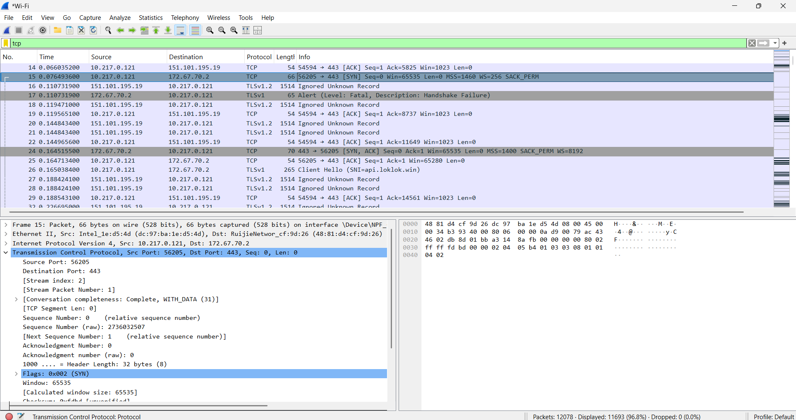
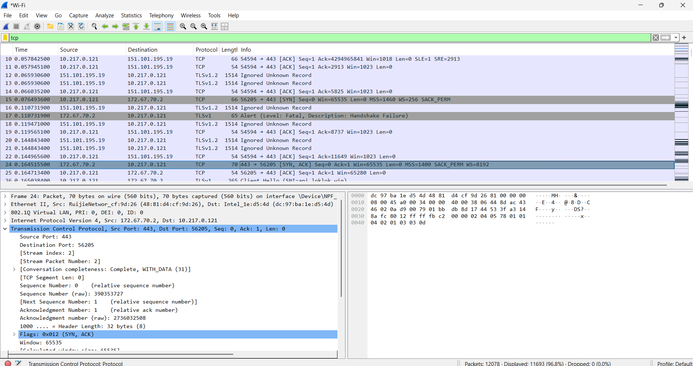
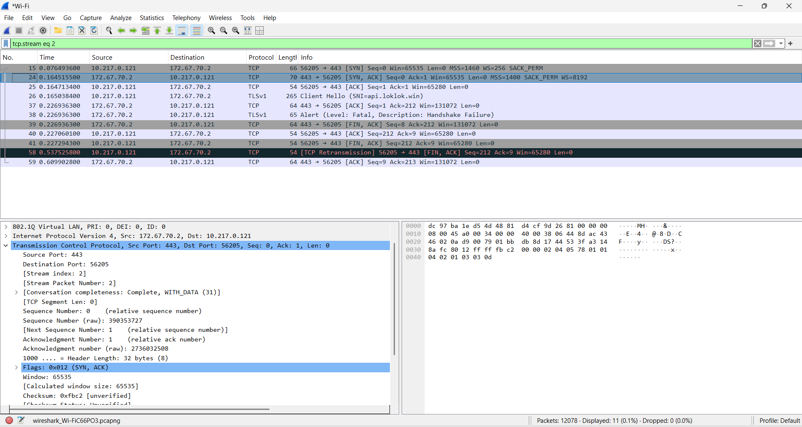
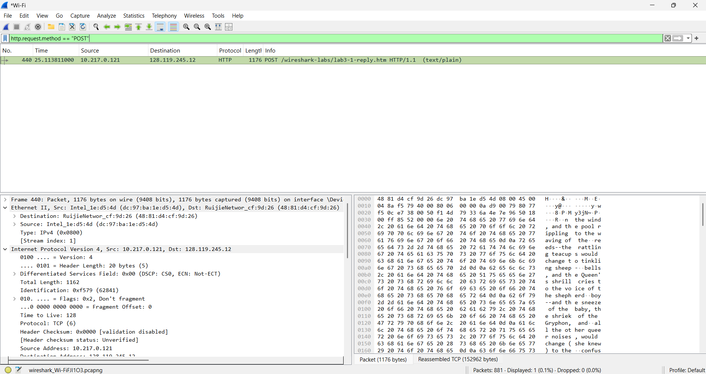
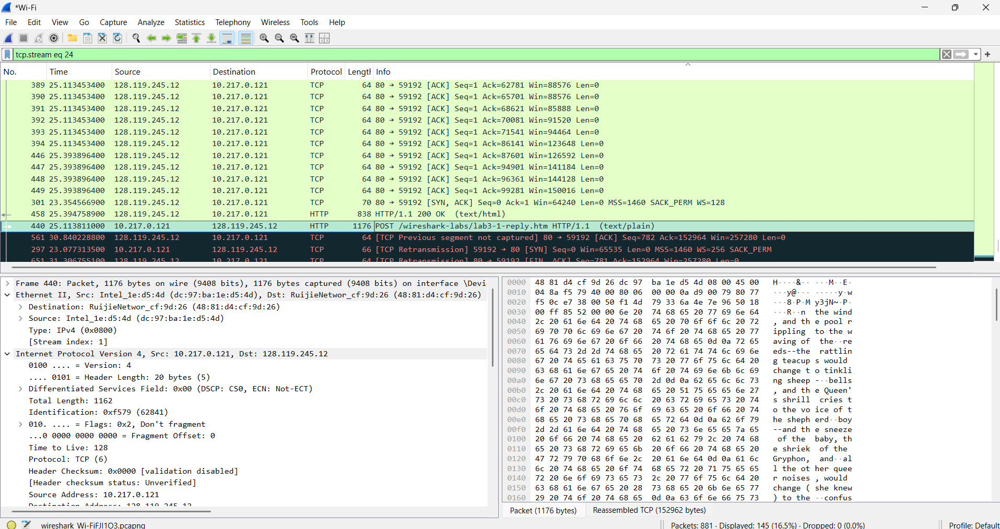

# Laporan Praktikum Jaringan Komputer – Modul 6

## Transmission Control Protocol (TCP)

---

## Identitas Praktikan

| Item  | Keterangan       |
| ----- | ---------------- |
| Nama  | Laura Chyndearni Saragih |
| NIM   | 103072400049     |
| Kelas | IF-04-01         |

---

## 6.1 Tujuan Praktikum

1. Menganalisis proses pembentukan koneksi TCP menggunakan Wireshark
2. Mengidentifikasi sequence number dan acknowledgement number
3. Mengamati proses pengiriman data menggunakan HTTP POST
4. Memahami segmentasi data pada protokol TCP

---

## 6.2 Analisis Three-Way Handshake TCP

### 1. SYN Segment

Berikut tampilan paket SYN (assets/tcp_syn_segment.png):



Informasi hasil capture:

```
Source IP      : 10.217.0.121
Destination IP : 172.67.70.2
Source Port    : 56205
Destination Port : 443
Sequence Number : 2736032507
Flags           : SYN
```

Analisis:

Segmen SYN dikirim oleh client untuk memulai koneksi TCP dengan server.

---

### 2. SYN-ACK Segment

Berikut tampilan paket SYN-ACK (assets/tcp_synack_segment.png):



Informasi hasil capture:

```
Source Port : 443
Destination Port : 56205
Sequence Number : 390353727
Acknowledgement Number : 2736032508
Flags : SYN, ACK
```

Analisis:

Server merespons permintaan koneksi dengan SYN-ACK serta mengirim acknowledgement terhadap sequence number client.

---

### 3. ACK Segment

Berikut tampilan paket ACK (assets/tcp_ack_segment.png):



Informasi hasil capture:

```
Sequence Number : 1
Acknowledgement Number : 1
Flags : ACK
```

Analisis:

Segmen ACK dikirim oleh client sebagai konfirmasi akhir sehingga koneksi TCP berhasil terbentuk.

---

## 6.3 Analisis HTTP POST Segment

Berikut tampilan paket HTTP POST (assets/tcp_http_post.png):



Informasi hasil capture:

```
Frame Number : 440
Source IP : 10.217.0.121
Destination IP : 128.119.245.12
Protocol : HTTP
Method : POST
URI : /wireshark-labs/lab3-1-reply.htm
Length : 1176 bytes
```

Analisis:

Segmen HTTP POST digunakan untuk mengirim file `alice.txt` dari client ke server melalui koneksi TCP.

---

## 6.4 Analisis TCP Segment of Reassembled PDU

Berikut tampilan TCP segment of a reassembled PDU (assets/tcp_reassembled_pdu.png):



Informasi hasil capture:

```
Reassembled TCP payload size : 152962 bytes
Protocol : TCP
Destination : 128.119.245.12
```

Analisis:

Data file `alice.txt` dikirim dalam beberapa segmen TCP dan kemudian direkonstruksi kembali oleh Wireshark menjadi satu kesatuan data (reassembled PDU).

---

## 6.5 Kesimpulan

1. Proses pembentukan koneksi TCP dilakukan melalui three-way handshake yaitu SYN, SYN-ACK, dan ACK
2. Sequence number dan acknowledgement number digunakan untuk menjaga reliabilitas komunikasi
3. HTTP POST digunakan untuk mengirim file dari client ke server melalui TCP
4. Data berukuran besar dikirim dalam beberapa segmen TCP sebelum direkonstruksi kembali menjadi satu kesatuan data
