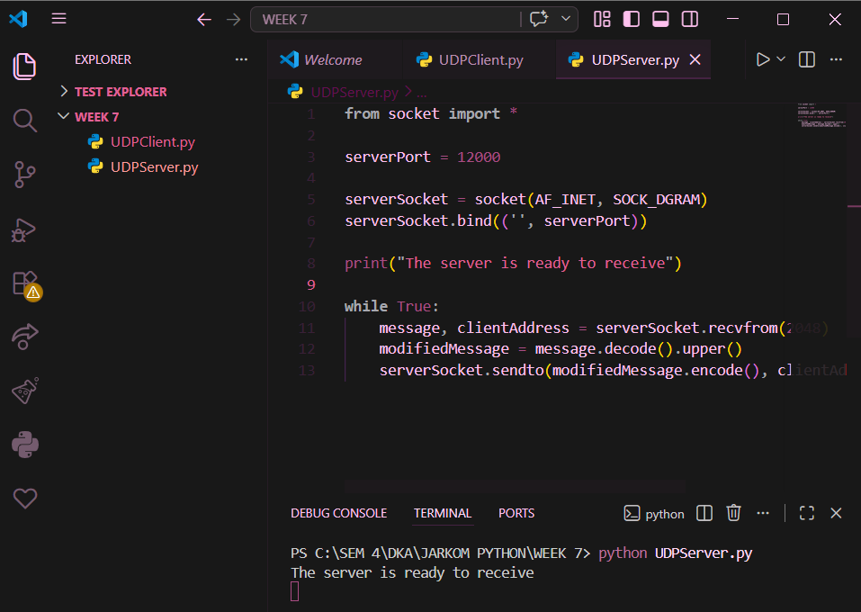
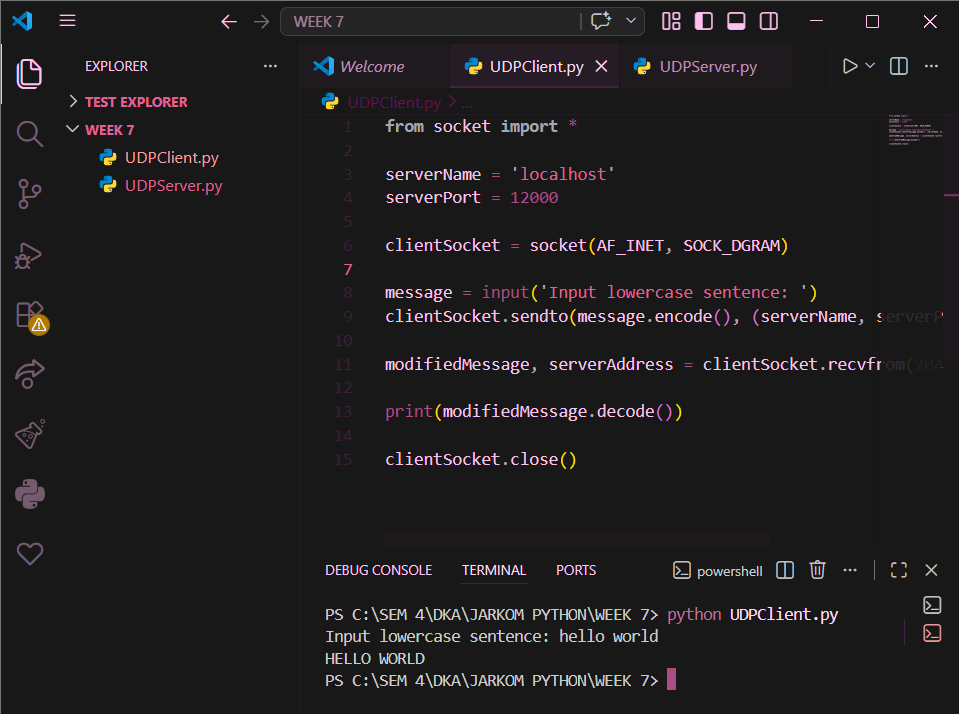
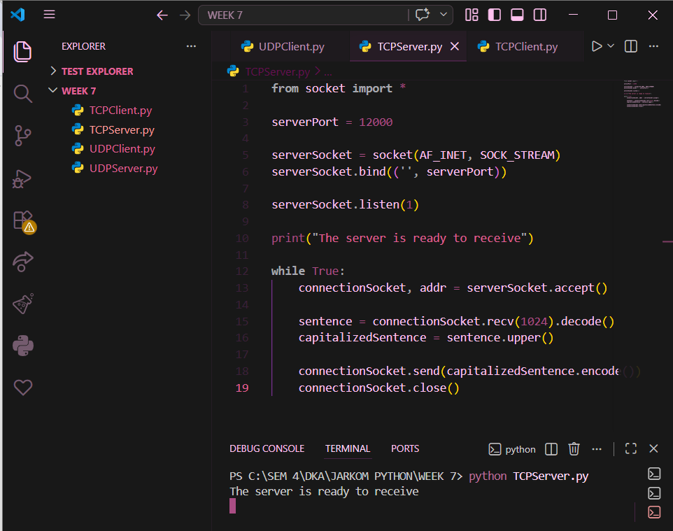

# Laporan Praktikum Jaringan Komputer – Modul 7

## Socket Programming: Membuat Aplikasi Jaringan

---

## Identitas Praktikan

| Item  | Keterangan       |
| ----- | ---------------- |
| Nama  | Laura Chyndearni |
| NIM   | 103072400049     |
| Kelas | IF-04-01         |

---

## 7.1 Tujuan Praktikum

1. Mahasiswa dapat memahami konsep socket programming menggunakan UDP
2. Mahasiswa dapat memahami konsep socket programming menggunakan TCP
3. Mahasiswa dapat membuat aplikasi komunikasi sederhana client-server menggunakan Python

---

## 7.2 Implementasi Socket Programming dengan UDP

Pada percobaan ini dibuat program client-server sederhana menggunakan protokol UDP. Client mengirimkan pesan ke server, kemudian server mengubah pesan menjadi huruf kapital dan mengirimkan kembali ke client.

### Tampilan Server UDP

Berikut tampilan server UDP saat dijalankan (assets/udp_server_running.png):

Server berada pada kondisi siap menerima pesan dari client melalui port 12000.

---

### Tampilan Client UDP

Berikut tampilan hasil client UDP setelah menerima balasan dari server (assets/udp_client_result.png):

Client mengirimkan pesan ke server dan menerima balasan berupa teks yang telah diubah menjadi huruf kapital.

---

## 7.3 Implementasi Socket Programming dengan TCP

Pada percobaan ini dibuat program client-server menggunakan protokol TCP. Berbeda dengan UDP, TCP menggunakan mekanisme connection-oriented sehingga diperlukan proses koneksi terlebih dahulu sebelum pertukaran data dilakukan.

### Tampilan Server TCP

Berikut tampilan server TCP saat dijalankan (assets/tcp_server_running.png):

Server berada dalam kondisi listening dan siap menerima koneksi dari client.

---

### Tampilan Client TCP

Berikut tampilan client TCP setelah menerima respon dari server (assets/tcp_client_result.png):

Client berhasil mengirimkan pesan ke server dan menerima balasan berupa teks huruf kapital.

---

## 7.4 Analisis Perbedaan UDP dan TCP

Perbedaan utama antara UDP dan TCP pada percobaan ini adalah:

| UDP                            | TCP                          |
| ------------------------------ | ---------------------------- |
| Tidak membutuhkan koneksi      | Membutuhkan koneksi          |
| Lebih cepat                    | Lebih stabil dan reliabel    |
| Tidak menjamin pengiriman data | Menjamin pengiriman data     |
| Tidak ada proses handshake     | Menggunakan proses handshake |

---

## 7.5 Kesimpulan

Berdasarkan percobaan yang telah dilakukan, dapat disimpulkan bahwa:

1. Socket programming memungkinkan komunikasi antara client dan server melalui jaringan
2. UDP digunakan untuk komunikasi tanpa koneksi sehingga proses lebih cepat
3. TCP digunakan untuk komunikasi yang membutuhkan koneksi yang stabil dan reliabel
4. Program client-server sederhana berhasil dibuat menggunakan Python baik dengan protokol UDP maupun TCP

