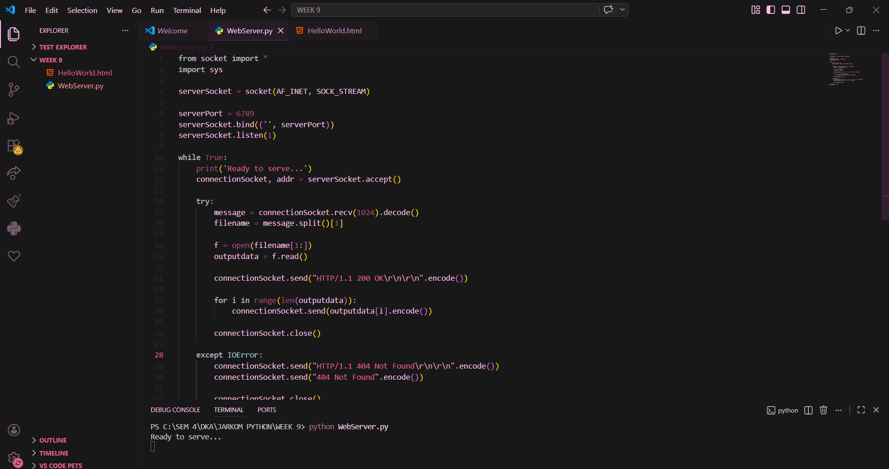
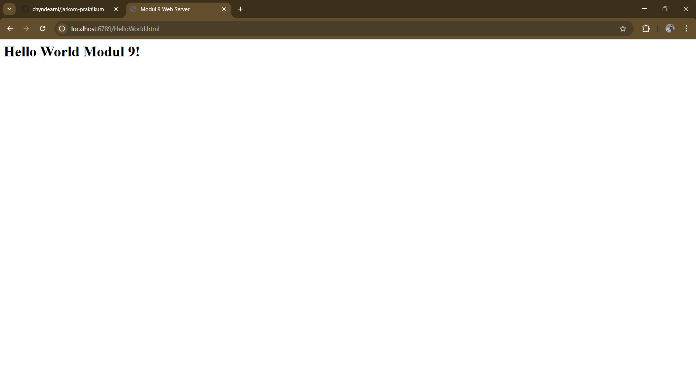
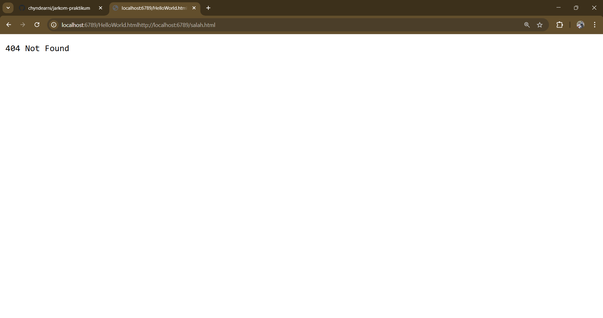

# Laporan Praktikum Jaringan Komputer – Modul 9

## Web Server Sederhana Berbasis TCP Socket

---

## Identitas Praktikan

| Item  | Keterangan       |
| ----- | ---------------- |
| Nama  | Laura Chyndearni |
| NIM   | 103072400049     |
| Kelas | IF-04-01         |

---

## 9.1 Tujuan Praktikum

1. Memahami konsep dasar komunikasi HTTP menggunakan socket programming
2. Membuat web server sederhana berbasis TCP menggunakan Python
3. Mengirim response HTTP 200 OK dan 404 Not Found sesuai permintaan client

---

## 9.2 Implementasi Web Server Sederhana

Pada praktikum ini dibuat sebuah web server sederhana menggunakan Python socket berbasis TCP. Server menerima request dari browser client, membaca file HTML dari direktori server, kemudian mengirimkan response HTTP ke client.

Jika file tersedia, server mengirimkan response **HTTP 200 OK**. Jika file tidak tersedia, server mengirimkan response **HTTP 404 Not Found**.

---

## 9.3 Menjalankan Web Server

Berikut tampilan saat server dijalankan pada terminal (assets/webserver_running.png):

Server berada pada kondisi **Ready to serve** yang berarti siap menerima request HTTP dari client melalui port 6789.

---

## 9.4 Akses File HTML dari Browser

Berikut tampilan browser saat berhasil mengakses file HTML dari server (assets/webserver_browser_success.png):

Browser berhasil menerima response dari server berupa file **HelloWorld.html** yang dikirim melalui protokol HTTP menggunakan koneksi TCP.

---

## 9.5 Pengujian Error 404 Not Found

Berikut tampilan browser saat mencoba mengakses file yang tidak tersedia di server (assets/webserver_404.png):

Server mengirimkan response **404 Not Found** karena file yang diminta tidak ditemukan pada direktori server.

---

## 9.6 Analisis

Web server bekerja dengan menerima request HTTP dari client melalui socket TCP pada port tertentu. Server kemudian membaca file yang diminta dan mengirimkan response HTTP yang sesuai.

Jika file tersedia, server mengirimkan:

HTTP/1.1 200 OK

Jika file tidak tersedia, server mengirimkan:

HTTP/1.1 404 Not Found

Hal ini menunjukkan bahwa server mampu menangani request client secara sederhana menggunakan mekanisme socket programming.

---

## 9.7 Kesimpulan

Berdasarkan praktikum yang telah dilakukan, dapat disimpulkan bahwa:

1. Web server sederhana dapat dibuat menggunakan Python socket berbasis TCP
2. Server mampu menerima request HTTP dari browser client
3. Server mampu mengirimkan response HTTP berupa file HTML
4. Server dapat menangani error dengan mengirimkan response 404 Not Found jika file tidak tersedia

